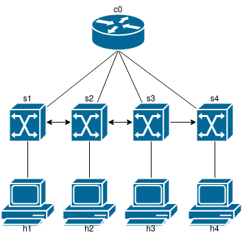

# P1. Mininet
## Francesc Folch Company

### 1. Prueba a ejecutar el comando route en los diferentes dispositivos. Este comando se utiliza cuando se quiere trabajar con la tabla de enrutamiento IP/kernel. Se utiliza principalmente para configurar rutas estáticas a hosts o redes específicas a través de una interfaz. Se utiliza para mostrar o actualizar la tabla de enrutamiento IP/kernel.

```Bash
mininet> c0 route
Kernel IP routing table
Destination     Gateway         Genmask         ...   Iface
default         fedora          0.0.0.0         ...   eth0
172.17.0.0      0.0.0.0         255.255.0.0     ...   eth0

mininet> h1 route
Kernel IP routing table
Destination     Gateway         Genmask         ...   Iface
10.0.0.0        0.0.0.0         255.0.0.0       ...   h1-eth0

mininet> h2 route
Kernel IP routing table:w
Destination     Gateway         Genmask         ...   Iface
10.0.0.0        0.0.0.0         255.0.0.0       ...   h2-eth0

mininet> s1 route 
Kernel IP routing table
Destination     Gateway         Genmask         ...   Iface
default         fedora          0.0.0.0         ...   eth0
172.17.0.0      0.0.0.0         255.255.0.0     ...   eth0
```

Como vemos, el Gateway de c0 es la máquina local que ejecuta ubuntu en una máquina virtual. 

### 2. Tras ejecutar `# mn --test pingall --topo linear,4` dibuja la estructura de red que obtienes con este ultimo.



### 3. Utilizando `ping` calcula la diferencia con el caso sin definir los "link parameters".

Observamos que, con un link delay de 10ms, el retraso de un ping pasa a ser de 40ms, ya que se suman 10ms por cada nodo que pasa el mensaje (h1-s1, s1-h2, h2-s1, s1-h1).
```Bash
mininet> h1 ping h2
PING 10.0.0.2 (10.0.0.2) 56(84) bytes of data.
64 bytes from 10.0.0.2: icmp_seq=1 ttl=64 time=43.3 ms
64 bytes from 10.0.0.2: icmp_seq=2 ttl=64 time=43.0 ms
```
Mientras que una configuración con un link por defecto el delay por ping ronda en torno a 1ms.

### 4. Ahora repite lo mismo pero utilizando el comando iperf. ¿Como?

Midiendo el ancho de banda de los link entre h1 y h2 con la configuración de `# mn --link tc,bw=10,delay=10ms` obtenemos:
```Bash
mininet> iperf
*** Iperf: testing TCP bandwidth between h1 and h2 
*** Results: ['8.64 Mbits/sec', '11.3 Mbits/sec']
```
Mientras que con una configuración estandar el ancho de banda llega a los 49Gbits/s.


### 5. Indica la secuencias de ordenes para ejecutar el server HTTP en h1 y el cliente get en h2 en la topologia minima de Mininet.

```Bash
# mn
--------
mininet> h1 python2 -m SimpleHTTPServer 80&
mininet> h1 ip a
Serving HTTP on 0.0.0.0 port 80 ...
1: lo: <LOOPBACK,UP,LOWER_UP> mtu 65536 qdisc noqueue state UNKNOWN group default qlen 1000
    link/loopback 00:00:00:00:00:00 brd 00:00:00:00:00:00
    inet 127.0.0.1/8 scope host lo
       valid_lft forever preferred_lft forever
    inet6 ::1/128 scope host 
       valid_lft forever preferred_lft forever
2: h1-eth0@if15: <BROADCAST,MULTICAST,UP,LOWER_UP> mtu 1500 qdisc noqueue state UP group default qlen 1000
    link/ether 92:d9:a1:ba:5a:42 brd ff:ff:ff:ff:ff:ff link-netnsid 0
    inet 10.0.0.1/8 brd 10.255.255.255 scope global h1-eth0
       valid_lft forever preferred_lft forever
    inet6 fe80::90d9:a1ff:feba:5a42/64 scope link 
       valid_lft forever preferred_lft forever
mininet> h2 wget -O - 10.0.0.1
--2021-12-20 22:02:13--  http://10.0.0.1/
Connecting to 10.0.0.1:80... connected.
HTTP request sent, awaiting response... 200 OK
Length: 424 [text/html]
Saving to: 'STDOUT'

<!DOCTYPE html PUBLIC "-//W3C//DTD HTML 3.2 Final//EN"><html>
<title>Directory listing for /</title>
<body>
<h2>Directory listing for /</h2>
<hr>
<ul>
<li><a href=".bash_history">.bash_history</a>
<li><a href=".bashrc">.bashrc</a>
<li><a href=".mininet_history">.mininet_history</a>
<li><a href=".profile">.profile</a>
<li><a href=".Xresources">.Xresources</a>
<li><a href="mininet/">mininet/</a>
</ul>
<hr>
</body>
</html>
     

2021-12-20 22:02:13 (82.1 MB/s) - written to stdout [424/424]

```


### 6- Modifica el codigo de la red de arriba para que imprima la direccion IP y el MAC de cada host.

Se ha añadido, antes de iniciar el CLI y después de mininet, este trozo de código:

```Python
info("Printing MAC addresses from hosts\n")
info("h1 mac: "+h1.MAC()+"\n")
info("h2 mac: "+h2.MAC()+"\n")
info("h3 mac: "+h3.MAC()+"\n")
info("h4 mac: "+h4.MAC()+"\n")
```

### 7- Modifica el codigo de la red de arriba, para que los enlaces sean de 10 Mbps y con un retardo de 10ms. Calcula las prestaciones del enlace entre h1 y h3

Primero se inicializa mininet con TCLink `net = Mininet( controller=OVSController, link=TCLink)`. Posteriormente, al crear los enlaces de cada host con el switch s1 se especifican los límites de ancho de banda y retraso:

```Python
info( '*** Creating links with performance limits\n' )
net.addLink( h1, s1, bw=10, delay='10ms', max_queue_size=1000, loss=10, use_htb=True )
net.addLink( h2, s1, bw=10, delay='10ms', max_queue_size=1000, loss=10, use_htb=True )
net.addLink( h3, s1, bw=10, delay='10ms', max_queue_size=1000, loss=10, use_htb=True )
net.addLink( h4, s1, bw=10, delay='10ms', max_queue_size=1000, loss=10, use_htb=True )
```

Con el comando `iperf h1 h3` mediremos las prestaciones del enlace entre h1 y h3, comprobando también que hemos aplicado bien los límites de ancho de banda y delay. El resultado es el siguiente:

```Bash
mininet> iperf h1 h3
*** Iperf: testing TCP bandwidth between h1 and h3 
*** Results: ['49.5 Kbits/sec', '267 Kbits/sec']
```

Con el comando `h1 ping h3` y `h3 ping h1` tambén vemos que los parámetros son correctos, si enviar 64 Bytes tiene un delay de 40ms más o menos, que es lo que tarda un paquete en llegar al destino y recibir respuesta con un retraso de 10ms por enlace.
