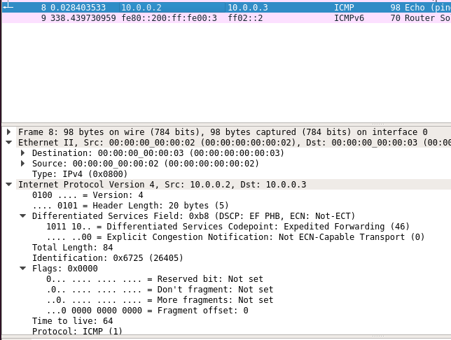

# P2. SDN with Mininet
## RSE - Francesc Folch Company

### 1. Tras hacer `pingall` 

Todos los hosts se alcanzan entre sí:
```
mininet> pingall
*** Ping: testing ping reachability
h1 -> h2 h3 
h2 -> h1 h3 
h3 -> h1 h2 
*** Results: 0% dropped (6/6 received)
```

### 2. Tras ejecutar `mininet> sh ovs-ofctl dump-flows s1`.
```
mininet> sh ovs-ofctl dump-flows s1
 cookie=0x0, duration=59.641s, table=0, n_packets=26, n_bytes=1820, actions=NORMAL
```

### 3. ¿Qué obtienes? ¿Por qué?

Tras quitar los flujos de ovs a través de s1, los hosts ya no se puedenen comunicar entre si.
```
mininet> pingall
*** Ping: testing ping reachability
h1 -> X X 
h2 -> X X 
h3 -> X X 
*** Results: 100% dropped (0/6 received)
```

### 4. Ejecuta ahora: `mininet> h1 ping -c2 h2` y luego `mininet> h3 ping -c2 h2` ¿Que obtienes? ¿Hay diferencias… Por que?

h1 y h2 se pueden comunicar entre si por las reglas definidas:
```
mininet> sh ovs-ofctl add-flow s1 priority=500,in_port=1,actions=output:2
mininet> sh ovs-ofctl add-flow s1 priority=500,in_port=2,actions=output:1
```

Pero h3 está aislado ya que solo están definidas las reglas de comunicación para que se enruten los paquetes por los puertos de s1 (s1-eth1 y s1-eth2) con openflow.

### 5. ¿Que efecto produce añadir este flow? Prueba con los ping de antes.

Ahora desecha todos los paquetes que pasen por s1, ya que la regla `drop` tiene más prioridad que las otras definidas.

### 6. Describe que hacen las dos lineas de configuración.

```
mininet> sh ovs-ofctl add-flow s1 priority=500,dl_type=0x800,nw_src=10.0.0.0/24,nw_dst=10.0.0.0/24,actions=normal
```
Esta linea modifica todos los paquetes de nivel de red (dl_type=0x800) y cambia la IP fuente por 10.0.0.0/24 y la destino por 10.0.0.0/24. Basicamente permite el tracifo de red.

```
sh ovs-ofctl add-flow s1 priority=800,dl_type=0x800,nw_src=10.0.0.3,nw_dst=10.0.0.0/24,actions=mod_nw_tos:184,normal
```

Esta línea modifica con mayor prioridad que la anterior (800) la ip fuente por la del h3 (10.0.0.3) y la destino por 10.0.0.0/24. Por lo que da prioridad a los paquetes del h3.

### 7. Prueba ahora si funciona con pingall. Comprueba con wireshark si efectivamente se modifica en los paquetes desde h3. 



### 8. ¿Que hace exactamente esta ultima regla?

Esta regla da mayor prioridad al trafico ip de salida de h3 para que los hosts clientes obtengan respuesta lo antesd posible.


### 9. Describe la funcion de los diferentes flows

