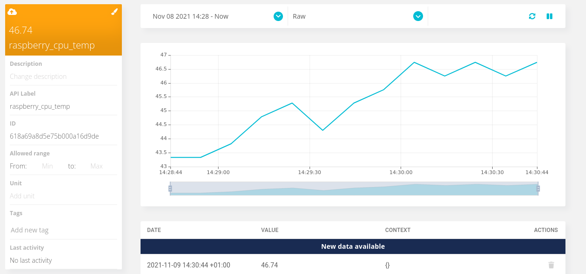
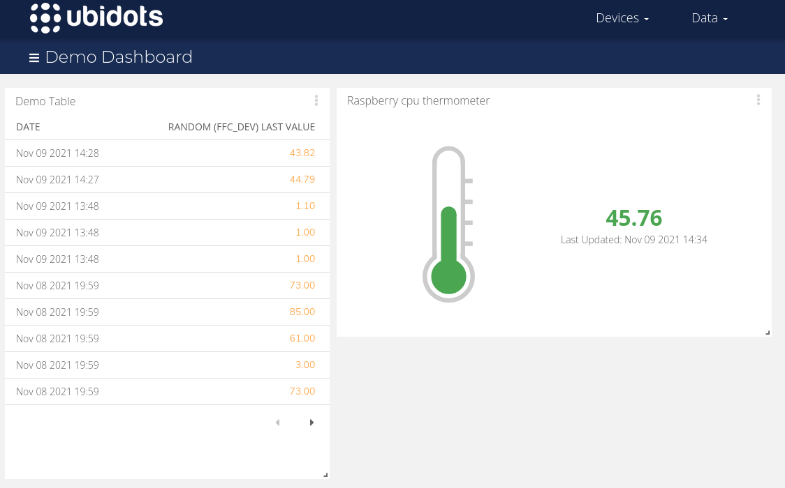

# P.4 MQTT y UBIDOTS

## Francesc Folch Company

### 1. Envía un número aleatorio entre 0 y 100 a Ubidots.

El código se incluye junto a la memoria, el script se llama `ubidots_pub.py` que publica en el *topic* `/v1.6/devices/ffc_de` y en la variable `random` cada 1 segundo.

- (opcional propio) 

También se ha adjuntado el script `rp_ubidots_pub.py`, programado para que mi raspberry pi envíe la temperatura de la cpu cada 10 segundos a la variable `raspberry_cpu_temp`. 

De esta manera se puede monitorizar el dispositivo sin acceder a el físicamente:

### 2. Crea un dashboard a tu gusto.

Se han creado dos widgets en el dashboard, uno que muestra una tabla de los valores de la variable `random` y otro en forma de termómetro que indica la temperatura de la cpu de la raspberry pi.

### 3. Utilizando como base el codigo del fichero lab4_ex3.py, escribe un programa que lee los datos desde TTN, como en la sesion de laboratorio anterior, selecciona una variable (p.ej. la temperatura), y la publica en Ubidots.

El script se llama `ttn_to_ubidots.py`, coge la variable temperatura y la publica en ubidots en la variable ttn_temperature.
