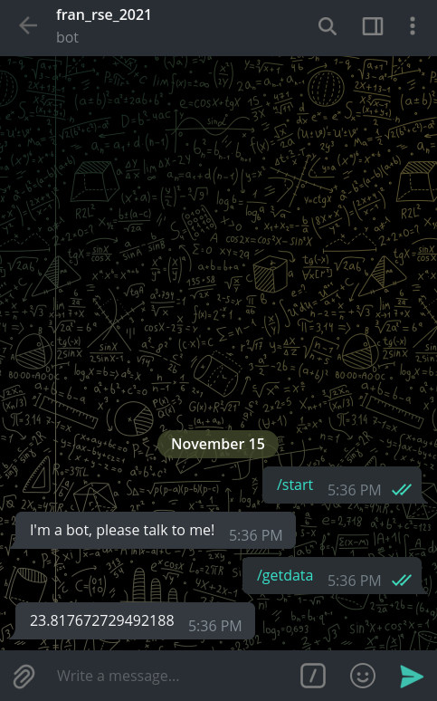

# P5. IoT - data to Telegram Bot
## Francesc Folch Company

### 1. Comprueba que el bot funciona

### 2. Modifica el Bot para que pueda devolver el valor de temperatura, humedad y luminosidad en función de la petición.

Para el siguiente ejercicio creamos 3 handler, uno para tempemperatura, otro para humedad y otro para luminosidad. El resultado es el siguiente:

