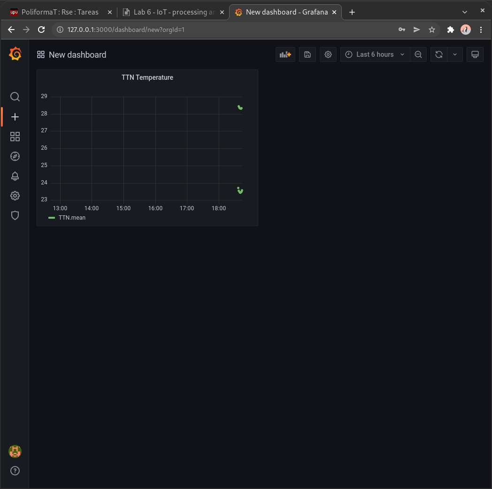

# P6. Telegraf, InfluxDB y Grafana

## Francesc Folch Company

### 1. Muestra el dashboard creado



### 2. Crea un programa python que imprima en pantalla los datos de temperatura y humedad de los ultimos 15 minutos.

Con la línea

```Python
res = client.query('SELECT * FROM "TTN" WHERE time > now() - 15m')
```

seleccionamos los valores de los últimos 15 minutos.