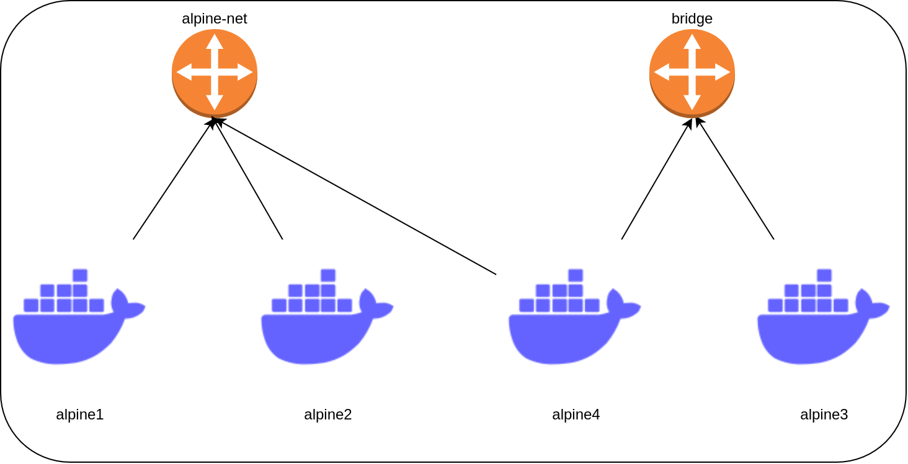

# P7. Docker

## Francesc Folch Company

### 1. Realiza las siguientes tareas desde un terminal:

- crea dos contenedores detached interactivos de una imagen de ubuntu y llamalos ubu1 y ubu2
- entra en ubu1 y crea un fichero con nombre test1 (pon alguna linea de texto, el contenido no importa). Sal de este contenedor con exit
- entra en ubu2 y crea un fichero con nombre test2 (pon alguna linea de texto, el contenido no importa). Sal de este contenedor con 'CTRL+p CTRL+q'
- usando docker exec ejecuta la orden ls -l en ambos contendedores. Explica la diferencia del resultado y como has procedido.

- SOLUCIÓN:

```
[root@fedora p7_docker]# docker run -dit --name ubu1 ubuntu
c2081a5d98f76f1b70566e17030a41193fcda2ba837f6228acd481c49f1f854e
[root@fedora p7_docker]# docker run -dit --name ubu2 ubuntu
9851fedac1c1c0e3f13761f46ae78bb91bca80366160f99ef6195135f729af92
[root@fedora p7_docker]# docker attach ubu1
root@c2081a5d98f7:/# cd
root@c2081a5d98f7:~# echo "Hola" >> test1
root@c2081a5d98f7:~# cat test1 
Hola
root@c2081a5d98f7:~# read escape sequence
[root@fedora p7_docker]# docker ps -a
CONTAINER ID   IMAGE     COMMAND       CREATED          STATUS                       PORTS     NAMES
9851fedac1c1   ubuntu    "bash"        2 minutes ago    Up 2 minutes                           ubu2
c2081a5d98f7   ubuntu    "bash"        4 minutes ago    Up 4 minutes                           ubu1
d1abe3706812   ubuntu    "/bin/bash"   10 minutes ago   Exited (127) 6 minutes ago             magical_moser
[root@fedora p7_docker]# docker exec 9851fedac1c1 ls -la /root
total 8
drwx------. 1 root root   30 Oct  6 16:58 .
drwxr-xr-x. 1 root root  174 Nov 30 11:16 ..
-rw-r--r--. 1 root root 3106 Dec  5  2019 .bashrc
-rw-r--r--. 1 root root  161 Dec  5  2019 .profile
[root@fedora p7_docker]# docker exec c2081a5d98f7 ls -la /root
total 12
drwx------. 1 root root   40 Nov 30 11:17 .
drwxr-xr-x. 1 root root  174 Nov 30 11:13 ..
-rw-r--r--. 1 root root 3106 Dec  5  2019 .bashrc
-rw-r--r--. 1 root root  161 Dec  5  2019 .profile
-rw-r--r--. 1 root root    5 Nov 30 11:17 test1
```

Como se observa en los dos últimos comandos, mientras que en el directorio /root del contenedor ubu1 no hay nada más que los archivos .bashrc y .profile, en 
el contenedor ubu2 se observa el archivo creado test1, que se generó con el comando echo "Hola" >> test1.


### 2. ¿Qué diferencias hay entre los dos comnados siguientes?

```
[root@fedora p7_docker]# docker run -dit --name alp1 alpine ash
Unable to find image 'alpine:latest' locally
latest: Pulling from library/alpine
59bf1c3509f3: Pull complete 
Digest: sha256:21a3deaa0d32a8057914f36584b5288d2e5ecc984380bc0118285c70fa8c9300
Status: Downloaded newer image for alpine:latest
577689b1d2220cc1f850964a24379f8d7d70c55fee4090c6a5d47d7a1d5bc8cf
[root@fedora p7_docker]# docker run -dit --name alp2 alpine ash
56175209238c0f69f820bf472de9717870458608fde41d165d86a7c2ee05eda8
```

Al ser la primera vez que se inicia un contenedor alpine, se tiene que descargar la imágen del repositorio de docker, library/alpine. La segunda vez solo tiene que 
crear el contenedor en base a la imágen que se ha descargado anteriormente.


### 3. ¿Que direccion IP tiene asignado el gateway entre el Docker host y la red? ¿Que direccion IP tienen los containers ‘alpine1’ y ‘alpine2’?

El gateway tiene la IP 172.17.0.1/16, se puede comprobar haciendo `ip a` en el host, donde se observa una interfaz llamada docker0 con esa dirección:

```
4: docker0: <BROADCAST,MULTICAST,UP,LOWER_UP> mtu 1500 qdisc noqueue state UP group default 
    link/ether 02:42:80:53:58:f1 brd ff:ff:ff:ff:ff:ff
    inet 172.17.0.1/16 brd 172.17.255.255 scope global docker0
       valid_lft forever preferred_lft forever
    inet6 fe80::42:80ff:fe53:58f1/64 scope link 
       valid_lft forever preferred_lft forever
```

Ejecutando `docker network inspect bridge` observamos que `alp1` tiene la IP 172.17.0.2/16 y `alp2` la 172.17.0.3/16.


### 4. Determina la IP de la red ‘alpine-net’ y si tiene containers conectados usando la orden ‘inspect’ que has utilizado anteriormente. ¿Que direccion tiene el bridge de default?

Con el comando `docker network inspect alpine-net` observamos que la subred es 172.18.0.0/16 y el gateway 172.18.0.1. Todavía no hay ningún contenedor conectado 
a la red.


### 5. Incluye un diagrama de la red




### 6. Conectate a ‘alpine1’ y usando ‘ping’ comprueba que es posible resolver automaticamente las direcciones de ‘alpine2’ and ‘alpine4’ a direcciones IP.

```
[root@fedora p7_docker]# docker attach alpine1
/ # ping alpine2
PING alpine2 (172.18.0.3): 56 data bytes
64 bytes from 172.18.0.3: seq=0 ttl=64 time=0.141 ms
64 bytes from 172.18.0.3: seq=1 ttl=64 time=0.056 ms
```

### 7. Determina la IP de ‘alpine3’ e intenta hacerle un ping. ¿Que resultado obtienes?

La dirección IP de alpine3 es 172.17.0.2, pero no se puede comunicar con alpine1 o con cualquier contenedor de la red alpine-net, ya que alpine3 está en una red diferente (bridge).

```
/ # ping -c 2 172.17.0.2
PING 172.17.0.2 (172.17.0.2): 56 data bytes

--- 172.17.0.2 ping statistics ---
2 packets transmitted, 0 packets received, 100% packet loss
```


### 8. Conectate a ‘alpine4’ e intenta hacer ‘ping’ a las otras maquinas. ¿Puedes alcanzar todas? ¿Con su IP o con su nombre?

Mientras se puede resolver la IP mediante el nombre de los contendores alpine1 y alpine2, para hacer ping a alpine3 hay que especificar su dirección IP. 

```
/ # ping alpine3
ping: bad address 'alpine3'
/ # ping -c 2 172.17.0.2
PING 172.17.0.2 (172.17.0.2): 56 data bytes
64 bytes from 172.17.0.2: seq=0 ttl=64 time=0.077 ms
64 bytes from 172.17.0.2: seq=1 ttl=64 time=0.062 ms

--- 172.17.0.2 ping statistics ---
2 packets transmitted, 2 packets received, 0% packet loss
round-trip min/avg/max = 0.062/0.069/0.077 ms
```

```
/ # ping -c 2 alpine1
PING alpine1 (172.18.0.2): 56 data bytes
64 bytes from 172.18.0.2: seq=0 ttl=64 time=0.060 ms
64 bytes from 172.18.0.2: seq=1 ttl=64 time=0.060 ms

--- alpine1 ping statistics ---
2 packets transmitted, 2 packets received, 0% packet loss
round-trip min/avg/max = 0.060/0.060/0.060 ms
/ # ping -c 2 alpine2
PING alpine2 (172.18.0.3): 56 data bytes
64 bytes from 172.18.0.3: seq=0 ttl=64 time=0.065 ms
64 bytes from 172.18.0.3: seq=1 ttl=64 time=0.063 ms

--- alpine2 ping statistics ---
2 packets transmitted, 2 packets received, 0% packet loss
round-trip min/avg/max = 0.063/0.064/0.065 ms
```


### 9. Como prueba final, comprueba de que todos los contenedores se puedan conectar a Internet haciendo ping a google.com. Ya estás conectado a alpine4, así que comienza intentando desde allí. A continuación, desconectate de ‘alpine4’ y conéctate a ‘alpine3’ (que solo está conectado a la red del bridge) e intenta nuevamente. Finalmente, conéctate a ‘alpine1’ (que solo está conectado a la red ‘alpine-net’) e intenta nuevamente.

Todos los contendores tienen acceso a internet, tanto los de la red bridge (alpine3) como los de la red alpine-net, y por supuesto, alpine4, que está en las dos redes.

